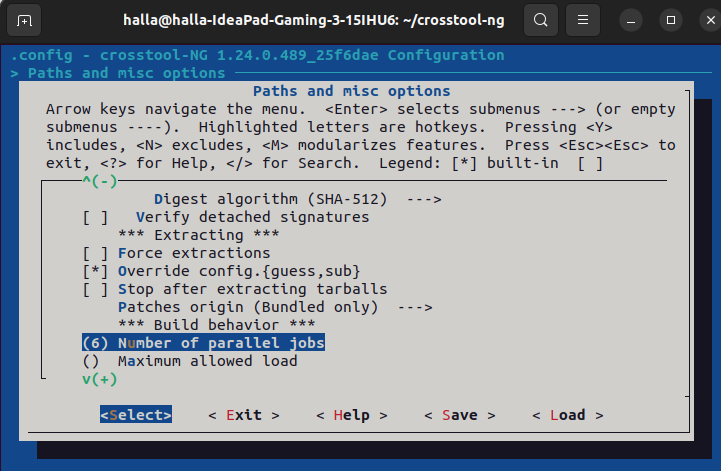

# Crosstool-ng ARM

1. after install all dependencies in AVR crosstool-ng Task
2. setup environment 

```
  ./bootstrap

```


3. check all dependencies 

```
  ./configure --enable-local

```


4. Generate Make file 

```
make
```

5. Grep all the supported arm arch supported by crosstool

```
 ./ct-ng list-samples | grep arm

```


6. Configure the mc

```
 ./ct-ng arm-cortexa9_neon-linux-gnueabihf

```


7. Configure in the menuconfig 

```
 ./ct-ng menuconfig
```


choose by *space on keyboard*

- Save Intermediate steps
-  Debug Crosstool-NG
- Interactive shell on failed commands 



then to increase the number of parallel jobs depends on your pc  


choose musl lib 


choose strace 

8. Build 

```
  ./ct-ng build

```


