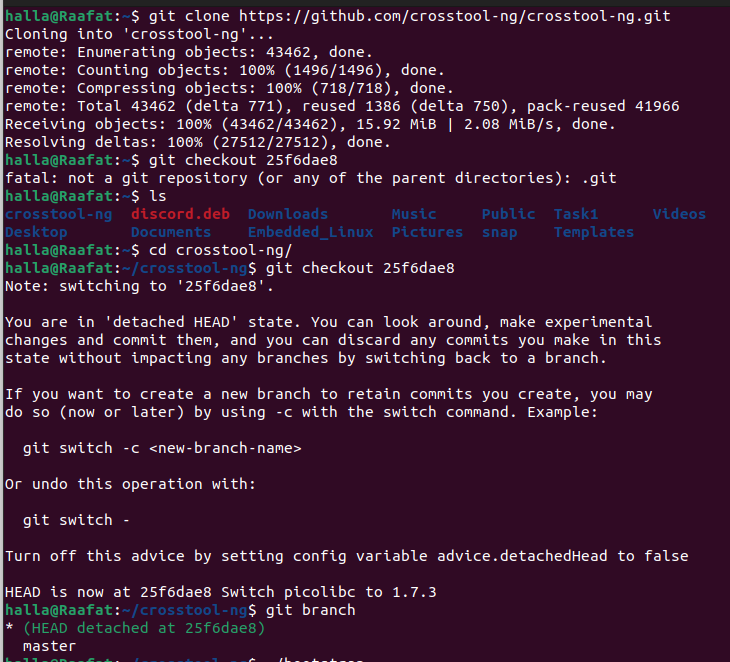
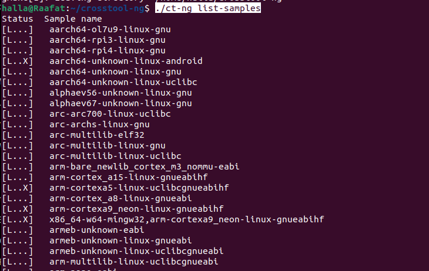
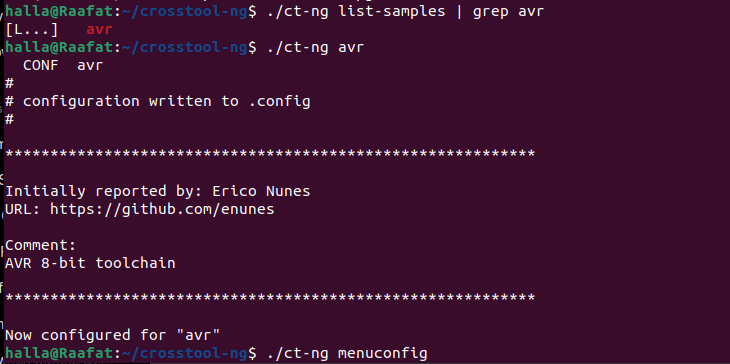
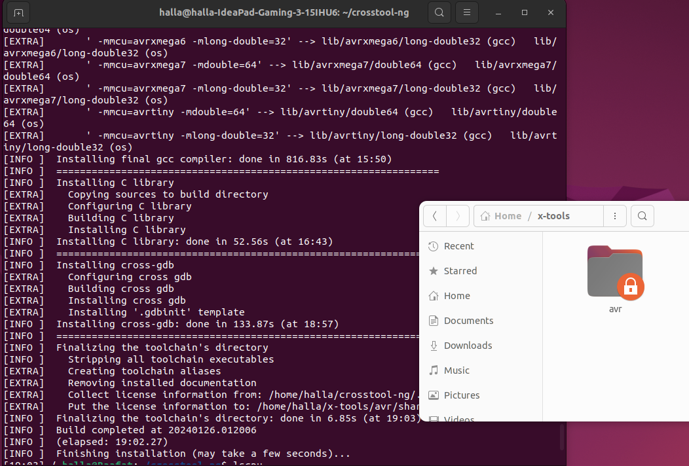

# Crosstool-ng 

1.clone the link of Crosstool-ng

```
git clone https://github.com/crosstool-ng/crosstool-ng.git

```

go to the directory of crosstool

```
cd crosstool-ng/
```

checkout this branch 

```
git checkout 25f6dae8
```



2. install the libraries needed 

   ```cmd
   sudo apt-get install -y gcc g++ gperf bison flex texinfo help2man make libncurses5-dev python3-dev autoconf automake libtool libtool-bin gawk wget bzip2 xz-utils unzip patch libstdc++6 rsync git meson ninja-build
   
   ```

3. unset LD variable 

   ```cmd
   unset LD_LIBRARY_PATH
   ```

4. ```
   ./bootstrap
   ```

5.  Run the following in sequence 

   ```
   ./configure --enable-local
   
   ```

   ```
   make 
   ```

   ```
   ./ct-ng list-samples
   ```

   to list all the mc supported 

    

```
./ct-ng avr
```

​    to select the target microcontroller 

​    

```
./ct-ng menuconfig
```

to change the parallel jobs or configure another parameters using the menu 

```
./ct-ng build 
```

to start building the  avr crosscompiler



check x-tools you will find avr compiler 