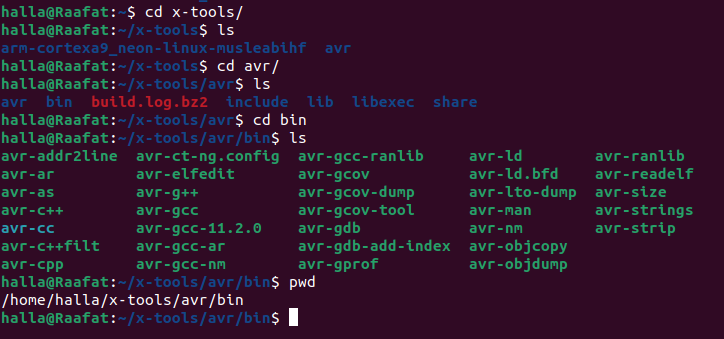
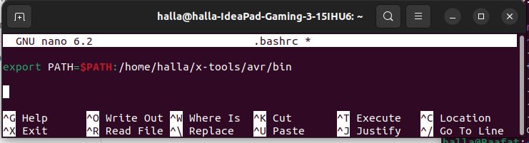
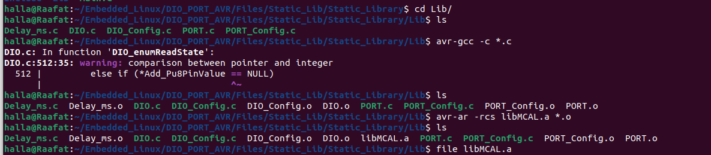
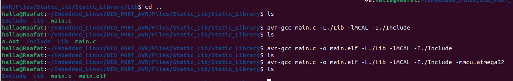

# GCC-AVR

#### 1. Get Path of AVR Compiler 

```
cd 
cd x-tools/avr/bin 
ls 
```

you can see the binary files supported by AVR compiler 

### 	



#### 2. Add AVR to PATH variable 

```
cd 
nano .bashrc 
```

```
#write in bashrc 
export PATH=$PATH:/home/(username)/x-tools/avr/bin
```



#### 3. Compile source files using avr-gcc

```
avr-gcc -c *.c
ls 
```

####  4. archive into static library 

```
 avr-ar -rcs libMCAL.a *.o
 ls
```

#### 5. link source file with library 

 

```
avr-gcc main.c -o main.elf -L./Lib -lMCAL -I./Include -mmcu=atmega32
```

- avr-gcc : compiler 
- main.c : application 
- -o main.elf : output file 
- -L./Lib : Location of Library
- -l MCAL : name of llibrary 
- -I./include : the location of the includes
- mmcu=atmega32: the target 





