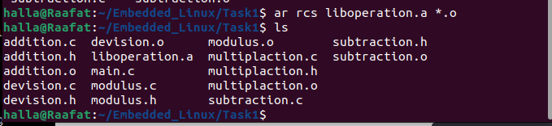

# Libraries 

1. ## Static Libraries 

   1. we need to compile the source files 

      ```
       gcc -c *.c
       rm main.o
      ```

      to compile all the source files and remove main.o 

   

   2. Archive all .o to create library 

      ```
      ar rcs liboperation.a *.o
      ```

      

      in naming the library must start with lib(name).a for static libraries 

      - **`ar`**: This is the archive command. It is used to create and maintain libraries of object files.
      - **`rcs`**:
        - **`r`**: Replace or add files to the archive.
        - **`c`**: Create the archive if it does not exist.
        - **`s`**: Write an index (or symbol table) into the archive. This index allows the linker to quickly search for symbols in the archive without having to read through all of the object files

   3. link with library 

      ```
      gcc main.c -o staticlink -L. -loperation -static
      ```

      to link main.c with operation library and name the output file "staticlink" 

      

2. ## Dynamic Libraries 

1. create object files 

   

   ```
   gcc -c -fPIC -I../headers/ *.c
   ```

   

   - `-c`: This flag tells `gcc` to compile the source files but not to link them, producing object files.
   - `-fPIC`: This flag generates position-independent code, which is necessary for creating shared libraries (dynamic libraries).
   - `-I/path/to/header/files`: This flag tells `gcc` where to look for header files. You can specify multiple `-I` flags if your header files are located in multiple directories.
   - `*.c`: This specifies all the C source files (`*.c`) in the current directory as input to the `gcc` command.

2. 

   